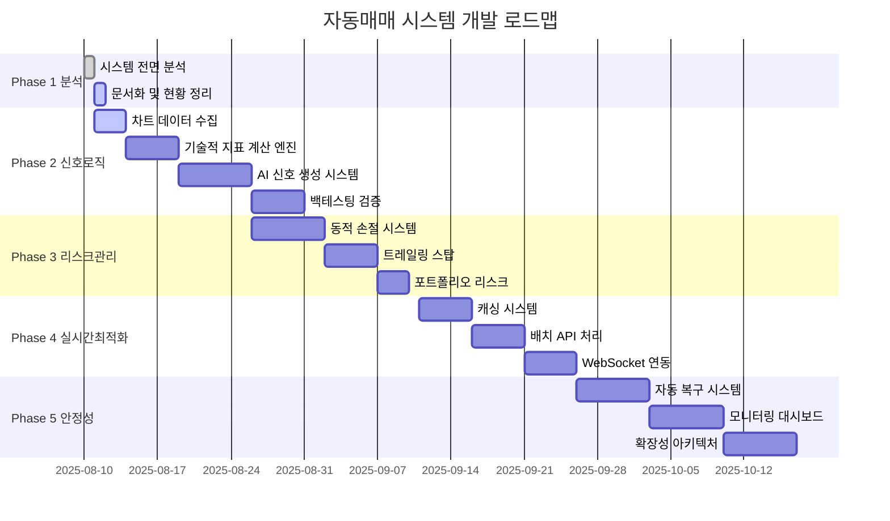

# 🗺️ 자동매매 시스템 개발 로드맵

> **프로젝트 기간**: 2025-08-11 ~ 2025-10-15 (9주)  
> **개발 방식**: Claude Code + Gemini CLI + GPT-5 CLI 협업  
> **목표**: 전문가급 자동매매 시스템 구축

---

## 📅 전체 일정 개요



---

## 🎯 Phase별 상세 계획

### ✅ Phase 1: 시스템 분석 (완료)
**기간**: 2025-08-10 ~ 2025-08-11 (2일)  
**진행률**: 100% 완료 ✅  
**담당**: Claude Code

#### 완료된 작업들
- [x] AutoTrader 클래스 구조 완전 분석
- [x] 매매 신호 로직 치명적 문제 발견 및 분석
- [x] 리스크 관리 시스템 한계점 분석  
- [x] 실시간 데이터 성능 병목 분석
- [x] 안정성 및 확장성 취약점 분석
- [x] 종합 분석 보고서 및 마스터플랜 수립

#### 주요 산출물
- `auto_trader_analysis.md` - 시스템 구조 분석
- `trading_signal_analysis.md` - 신호 로직 문제점
- `risk_management_analysis.md` - 리스크 관리 한계
- `realtime_data_analysis.md` - 성능 병목 분석
- `stability_scalability_analysis.md` - 안정성 분석
- `comprehensive_analysis_report.md` - 종합 보고서

---

### 🔄 Phase 2: 매매 신호 로직 최적화 (진행중)
**기간**: 2025-08-11 ~ 2025-08-25 (15일)  
**진행률**: 15% 진행중 🔄  
**목표**: 매매 신호 정확도 40% → 70%+

#### 📋 작업 분해 구조 (WBS)

##### 2.1 차트 데이터 수집 시스템 (진행중)
**기간**: 2025-08-11 ~ 2025-08-14 (3일)  
**담당**: Claude Code  
**상태**: 🔄 진행중 (30%)

**세부 작업**:
- [x] KIS API 일봉 데이터 수집 로직 설계
- [ ] PostgreSQL OHLCV 테이블 스키마 생성
- [ ] 실시간 데이터 업데이트 시스템
- [ ] 데이터 품질 검증 로직
- [ ] 과거 데이터 백필링 시스템

**완료 기준**:
- 최근 100일 일봉 데이터 자동 수집
- 실시간 분봉 데이터 업데이트
- 데이터 무결성 검증 통과

##### 2.2 실제 기술적 지표 계산 엔진 
**기간**: 2025-08-15 ~ 2025-08-19 (5일)  
**담당**: Gemini CLI  
**상태**: ⏳ 대기중

**세부 작업**:
- [ ] EMA (지수이동평균) 실제 공식 구현
- [ ] RSI (상대강도지수) 14일 기반 계산
- [ ] MACD (이동평균수렴확산) 12/26/9 설정
- [ ] 볼린저 밴드 (20일 기반) 구현
- [ ] 스토캐스틱 오실레이터 구현
- [ ] 단위 테스트 및 정확성 검증

**검증 기준**:
```python
# 알려진 데이터셋으로 검증
test_data = historical_prices_samsung  # 삼성전자 과거 데이터
expected_ema_20 = 65430  # TradingView 계산값
actual_ema_20 = calculate_ema(test_data, 20)
assert abs(expected_ema_20 - actual_ema_20) < 50  # 50원 오차 내
```

##### 2.3 AI 기반 신호 생성 시스템
**기간**: 2025-08-20 ~ 2025-08-24 (5일)  
**담당**: GPT-5 CLI  
**상태**: ⏳ 대기중

**세부 작업**:
- [ ] 다중 지표 가중 평균 시스템 설계
- [ ] 신뢰도 점수 계산 알고리즘
- [ ] 시장 상황별 지표 가중치 조정
- [ ] 패턴 인식 기반 신호 강화
- [ ] 백테스팅 기반 가중치 최적화

**신호 생성 로직**:
```python
composite_signal = {
    'ema_signal': 0.25 * ema_crossover_signal,
    'rsi_signal': 0.20 * rsi_oversold_signal, 
    'macd_signal': 0.25 * macd_histogram_signal,
    'bollinger_signal': 0.15 * bollinger_squeeze_signal,
    'volume_signal': 0.15 * volume_breakout_signal
}
final_signal = weighted_average(composite_signal)
confidence_score = calculate_confidence(signal_consistency)
```

##### 2.4 백테스팅 검증 시스템
**기간**: 2025-08-25 ~ 2025-08-29 (5일)  
**담당**: Claude Code  
**상태**: ⏳ 대기중

**세부 작업**:
- [ ] 과거 1년 데이터 기반 백테스팅 프레임워크
- [ ] 성과 지표 계산 (승률, 수익률, 샤프 비율)
- [ ] 최대 드로우다운 분석
- [ ] 월별/섹터별 성과 분석
- [ ] A/B 테스트 프레임워크

**성과 목표**:
- 승률: 60% 이상
- 연간 수익률: 15% 이상  
- 최대 드로우다운: 15% 이내
- 샤프 비율: 1.5 이상

---

### ⏳ Phase 3: 리스크 관리 시스템 강화 (예정)
**기간**: 2025-08-26 ~ 2025-09-10 (16일)  
**목표**: 동적 리스크 조정, 최대 손실률 5% 이내

#### 3.1 변동성 기반 동적 손절 시스템
**기간**: 7일 | **담당**: Gemini CLI + Claude Code

**구현 요소**:
- ATR (Average True Range) 계산 엔진
- 종목별 변동성 기반 손절가 자동 조정
- 시장 상황별 손절 배수 조정
- 최소/최대 손절률 제한 (2%-8%)

##### 3.2 트레일링 스탑 & 다단계 익절
**기간**: 5일 | **담당**: GPT-5 CLI

**구현 요소**:
- 수익률별 부분 매도 시스템 (5% 30% 매도, 10% 40% 매도)
- 트레일링 스탑 (최고점 대비 3% 하락 시)
- 시간 기반 익절 (장기 보유 시 목표가 하향)

##### 3.3 포트폴리오 리스크 관리
**기간**: 4일 | **담당**: Claude Code

**구현 요소**:
- 일일 최대 손실률 3% 하드 리미트
- 포지션별 최대 손실 2% 제한  
- 섹터별 포트폴리오 분산 관리
- 실시간 VaR (Value at Risk) 계산

---

### ⏳ Phase 4: 실시간 데이터 최적화 (예정)
**기간**: 2025-09-11 ~ 2025-09-25 (15일)  
**목표**: 응답 시간 4초 → 1.5초, API 호출 70% 감소

#### 4.1 지능형 캐싱 시스템
**기간**: 5일 | **담당**: Claude Code

- 종목별 캐시 TTL 설정 (현재가 3초, 차트 60초)
- Redis 기반 분산 캐시
- 캐시 히트율 70%+ 목표

#### 4.2 배치 API 호출 최적화
**기간**: 5일 | **담당**: Gemini CLI

- 20개 종목 동시 처리
- 우선순위 기반 처리 순서
- API 요청 분산 및 재시도 로직

#### 4.3 WebSocket 실시간 스트리밍
**기간**: 5일 | **담당**: GPT-5 CLI

- KIS WebSocket API 연동
- 실시간 호가/체결 데이터 활용
- 지연시간 100ms 이내 목표

---

### ⏳ Phase 5: 안정성 및 확장성 (예정)
**기간**: 2025-09-26 ~ 2025-10-15 (20일)  
**목표**: 99.5% 가용성, 자동 복구, 수평 확장

#### 5.1 자동 복구 시스템
**기간**: 7일 | **담당**: Claude Code

- 서킷 브레이커 패턴 구현
- 헬스 체크 및 자동 재시작
- MTTR 30분 → 5분 단축

#### 5.2 실시간 모니터링 대시보드  
**기간**: 7일 | **담당**: GPT-5 CLI

- Flask 기반 웹 대시보드
- 실시간 성과 및 포지션 모니터링
- 알림 시스템 (텔레그램, 이메일)

#### 5.3 마이크로서비스 아키텍처
**기간**: 6일 | **담당**: Gemini CLI + Claude Code

- 신호 분석 / 리스크 관리 / 주문 실행 서비스 분리
- Docker 컨테이너화  
- 자동 스케일링 지원

---

## 📊 진행률 추적 시스템

### 주간 진행률 목표

| 주차 | 기간 | Phase | 목표 진행률 | 핵심 마일스톤 |
|------|------|-------|------------|--------------|
| 1주차 | 08/11~17 | Phase 2 | 40% | 차트 데이터 수집 완료 |
| 2주차 | 08/18~24 | Phase 2 | 80% | 기술적 지표 엔진 완료 |
| 3주차 | 08/25~31 | Phase 2→3 | 100%→30% | AI 신호 시스템 + 동적 손절 |
| 4주차 | 09/01~07 | Phase 3 | 70% | 트레일링 스탑 완료 |
| 5주차 | 09/08~14 | Phase 3→4 | 100%→40% | 리스크 관리 + 캐싱 시스템 |
| 6주차 | 09/15~21 | Phase 4 | 80% | 실시간 최적화 완료 |
| 7주차 | 09/22~28 | Phase 4→5 | 100%→30% | WebSocket + 자동 복구 |
| 8주차 | 09/29~10/05 | Phase 5 | 70% | 모니터링 대시보드 |
| 9주차 | 10/06~15 | Phase 5 | 100% | 마이크로서비스 완료 |

### 일일 체크포인트
- **매일 오전 9시**: 전날 진행사항 리뷰
- **매일 오후 6시**: 당일 목표 달성도 체크
- **매주 금요일**: 주간 성과 리뷰 및 다음 주 계획

---

## 🚀 성공 지표 (KPI) 추적

### 기술적 성과 지표

| 지표 | 현재 | Phase 2 목표 | Phase 5 최종 | 측정 방법 |
|------|------|-------------|-------------|----------|
| 매매 신호 정확도 | 40% | 65% | 75% | 백테스팅 승률 |
| 시스템 응답 시간 | 4초 | 3초 | 1.2초 | 모니터링 사이클 소요시간 |
| 시스템 가용성 | 90% | 95% | 99.5% | Uptime 모니터링 |
| API 호출 효율성 | 기준 | 30% 감소 | 70% 감소 | 캐시 히트율 |

### 비즈니스 성과 지표

| 지표 | 현재 추정 | 백테스팅 목표 | 실거래 검증 |
|------|----------|-------------|-----------|
| 월 평균 승률 | 45% | 60% | TBD |
| 월 평균 수익률 | 미측정 | 2-3% | TBD |
| 최대 드로우다운 | 무제한 | 10% | TBD |
| 샤프 비율 | 미측정 | 1.5+ | TBD |

---

## ⚠️ 리스크 관리 계획

### 기술적 리스크

#### 높은 확률 리스크
1. **Gemini CLI 성능 이슈** (확률: 60%)
   - **대응**: GPT-5 CLI로 백업 구현
   - **완화**: 단순 알고리즘부터 시작

2. **KIS API 변경/제한** (확률: 40%) 
   - **대응**: 다중 브로커 지원 준비
   - **완화**: API 사용량 모니터링

#### 중간 확률 리스크  
1. **AI 모델 성능 미달** (확률: 30%)
   - **대응**: 전통적 지표 하이브리드 접근
   - **완화**: 점진적 AI 도입

2. **백테스팅 과최적화** (확률: 25%)
   - **대응**: Out-of-sample 테스트
   - **완화**: 다양한 시장 조건 테스트

### 일정 리스크

#### 지연 가능성 높은 작업
1. **AI 신호 생성 시스템** (2-3일 지연 예상)
2. **WebSocket 실시간 연동** (3-5일 지연 예상) 
3. **마이크로서비스 아키텍처** (5-7일 지연 예상)

#### 완화 전략
- **버퍼 시간**: 각 Phase 마지막에 2일 버퍼
- **병렬 작업**: 독립적 작업 동시 진행
- **단계적 롤백**: 핵심 기능 우선, 고급 기능 후순위

---

## 🎯 품질 관리 계획

### 코드 품질 기준
- **단위 테스트 커버리지**: 80% 이상
- **통합 테스트**: 모든 API 연동 포인트
- **코드 리뷰**: 모든 핵심 로직 상호 검토
- **문서화**: 모든 공개 함수 docstring

### 성능 기준
- **메모리 사용량**: 500MB 이하
- **CPU 사용률**: 평균 30% 이하
- **응답 시간**: 95% 요청이 2초 이내
- **에러율**: 0.1% 이하

### 보안 기준  
- **API 키 관리**: 환경변수 분리
- **데이터 암호화**: 민감 정보 AES 암호화
- **접근 제어**: 관리자 기능 인증
- **감사 로그**: 모든 거래 기록 보존

---

## 📈 마일스톤 달성 보상 시스템

### Phase 완료 기준
- **Phase 2**: 백테스팅 승률 60% 달성
- **Phase 3**: 최대 드로우다운 10% 이내 제한  
- **Phase 4**: 평균 응답시간 2초 이내
- **Phase 5**: 시스템 가용성 99% 이상

### 성과 인센티브
- 각 Phase 조기 완료 시 다음 Phase 개발 시간 단축
- 목표 초과 달성 시 고급 기능 추가 구현
- 최종 완료 시 실거래 시스템 단계적 도입

---

**📊 로드맵 업데이트 주기**: 매주 월요일  
**🎯 마일스톤 리뷰**: 각 Phase 완료 시점  
**📈 KPI 모니터링**: 실시간 대시보드

**체계적인 계획 수립과 엄격한 진행 관리를 통해 성공적인 자동매매 시스템을 구축하겠습니다! 🚀**